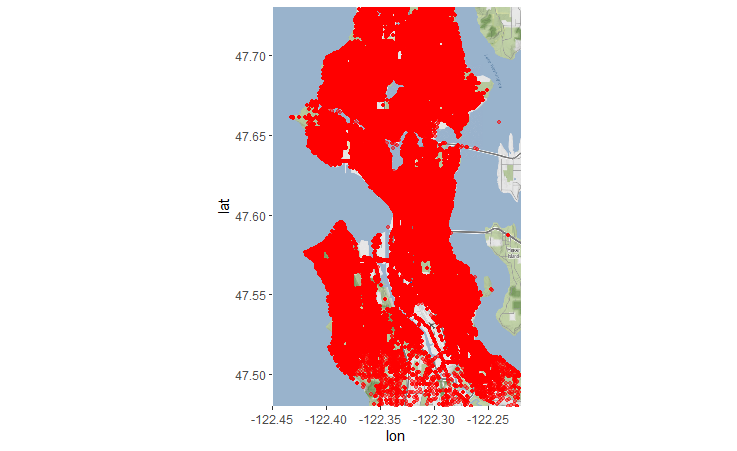

```{r setup, include=FALSE}
knitr::opts_chunk$set(echo = TRUE, fig.align = "center")
```

### Dataset on Police Incidents in the City of Seattle

The dataset on police incidents in the City of Seattle includes a collection of events related to 911 emergency calls recorded from 2010 to the present day. The dataset contains approximately 10 million records and has a total size of 5.6GB. It is an open dataset obtained from the official website of the City of Seattle and is available at the following
[link](https://data.seattle.gov/Public-Safety/Call-Data/33kz-ixgy/about_data).

This dataset contains information about calls made to the police and the corresponding police responses in Seattle. The columns in the dataset are as follows:

1.  **CAD Event Number** – Unique event identification number.
2.  **Event Clearance Description** – How the police resolved the event.
3.  **Call Type** – Type of call with 10 different values (911, Alarm, Onview, etc.)
4.  **Priority** – Call priority with values ranging from 1 (lowest priority) to 9 (highest priority).
5.  **Initial Call Type** – Initial classification of the call by the 911 call center operator, with 325 different values.
6.  **Final Call Type** – Final classification of the call by the police officer after review, with 431 different values.
7.  **Original Time Queued** – Time when the call was recorded.
8.  **Arrived Time** – Time when the police arrived at the scene.
9.  **Precinct** – Police station in Seattle.
10. **Sector** – Police sector.
11. **Beat** – The area and time during which a police officer is on patrol.
12. **Blurred_Longitude** – Geographic longitude of the event.
13. **Blurred_Latitude** – Geographic latitude of the event.

The dataset provides detailed information on all calls received by the police, including call types, priorities, call and response times, as well as the geographic locations of the incidents. It also includes the initial and final classification of each call, enabling analysis of how incidents are categorized and resolved.

# Initial Data Preparation

## Loading and Preparing the Necessary Libraries

```{r eval=T, results='hide', include=FALSE}
library(dplyr)
library(ggplot2)
library(knitr)
library(ggmap)
library(sparklyr)

Sys.setenv(JAVA_HOME = "/usr/lib/jvm/java-17-openjdk-amd64")

#spark_install(version = "3.5")
conf <- spark_config()
conf$`sparklyr.shell.driver-memory` <- "6G"
conf$spark.memory.fraction <- 0.7
conf$spark.sql.shuffle.partitions <- "20"

sc <- spark_connect(master = "local[4]", 
                    version = "3.5",
                    config = conf)
```

## Data Loading

-   Given the size of the dataset (5.6 GB), the data is loaded and further transformed using Apache Spark tools.

-   To ensure the correct data types are used, a schema is specified according to which Spark loads the data frames.

```{r eval = T, results = 'hold'}
schema <- list(
  CAD_Event_Number = "character",
  Event_Clearance_Description = "character",
  Call_Type = "character",
  Priority = "character",
  Initial_Call_Type = "character",
  Final_Call_Type = "character",
  Original_Time_Queued = "character",
  Arrived_Time = "character",
  Precinct = "character",
  Sector = "character",
  Beat = "character",
  Blurred_Longitude = "numeric",
  Blurred_Latitude = "numeric"
)

df <- spark_read_csv(sc, name = "police_calls", path = "Call_Data.csv", header = TRUE, columns = schema)

```

## Data Preparation for Analysis

-   In order to perform a proper data analysis, it is necessary to carry out several transformations on the initial dataset:
  
### Removing All Missing Values from the Dataset

```{r eval=T, results='hold'}
df_clean <- df %>% na.omit()
```

### Converting Data to the Appropriate Format

```{r eval = T, results='hold'}
df_clean <- df_clean %>%
  mutate(
    Original_Time_Queued = to_timestamp(Original_Time_Queued, "MM/dd/yyyy hh:mm:ss a"),
    Arrived_Time = to_timestamp(Arrived_Time, "yyyy MMM dd hh:mm:ss a")
  )

```

### Filtering Cases Where the Police Arrival Time Precedes the Incident Time

-   This is an impossible case

```{r}
df_clean <- df_clean %>%
  filter(!is.na(Original_Time_Queued) & !is.na(Arrived_Time) & Original_Time_Queued < Arrived_Time)
```

rmarkdown::render("Documentation.Rmd")

# Visualization of the Distribution of Individual Features and Relationships Between Features

### Displaying Statistical Information on Incident Times

```{r}
df_clean %>% summarise(
  min_original_time = min(Original_Time_Queued, na.rm = TRUE),
  max_original_time = max(Original_Time_Queued, na.rm = TRUE),
  min_arrived_time = min(Arrived_Time, na.rm = TRUE),
  max_arrived_time = max(Arrived_Time, na.rm = TRUE)
) %>% collect()
```

### Visualization of the Distribution by Police Precincts

```{r}
precinct_counts <- df_clean %>%
  group_by(Precinct) %>%
  summarise(Count = n()) %>%
  collect()

ggplot(precinct_counts, aes(x = Precinct, y = Count, fill = Precinct)) +
  geom_bar(stat = "identity") +
  labs(title = "Distribution by Police Precincts",
       x = "Police Precinct",
       y = "Number of Occurrences",
       fill = "Precinct")

rm(precinct_counts)
gc()
```

- It can be observed that the highest number of police responses occurred in the northern and western precincts.


### Visualization of the Distribution by Case Resolution Type

```{r}
clearence_counts <- df_clean %>%
  group_by(Event_Clearance_Description) %>%
  summarise(Count = n()) %>%
  collect()

clearence_counts <- clearence_counts %>% filter(Count >= 5000)

ggplot(clearence_counts, aes(x = Event_Clearance_Description, y = Count, fill = Event_Clearance_Description)) +
  geom_bar(stat = "identity") +
  labs(title = "Distribution by Case Resolution Type",
       x = "Resolution",
       y = "Number of Occurrences",
       fill = "Resolution Type") +
  theme(axis.text.x = element_blank())

rm(clearence_counts)
gc()
```

### Visualization of the Distribution by Priority

```{r}
priority_counts <- df_clean %>%
  group_by(Priority) %>%
  summarise(Count = n())

ggplot(priority_counts, aes(x = Priority, y = Count, fill = Priority)) +
  geom_bar(stat = "identity") +
  labs(title = "Distribution by Priority",
       x = "Priority",
       y = "Number of Occurrences",
       fill = "Priority")

rm(priority_counts)
gc()
```

### Visualization of the Distribution by 911 Call Type

```{r}
call_type_counts <- df_clean %>%
  group_by(Call_Type) %>%
  summarise(Count = n())

call_type_counts <- call_type_counts %>% filter(Count > 5000)

ggplot(call_type_counts, aes(x = Call_Type, y = Count, fill = Call_Type)) +
  geom_bar(stat = "identity") +
  labs(title = "Distribution by Call Method",
       x = "Call Method",
       y = "Number of Occurrences",
       fill = "Call Method") +
  theme(axis.text.x = element_blank())

rm(call_type_counts)
gc()
```

### Visualization of the Distribution of Latitude and Longitude

- By creating histograms for the location data, it can be observed that there are certain events with incorrectly specified latitude or longitude values. The following code snippet shows the distributions of latitude and longitude values, as well as the process of adjusting them to match the coordinates of the city of Seattle.

```{r eval=T, results='hold'}
location_sample <- df_clean %>%
  select(Blurred_Longitude, Blurred_Latitude) %>%
  sdf_sample(fraction = 0.5, replacement = FALSE) %>%
  collect()


ggplot(data = location_sample, aes(x = Blurred_Longitude)) +
  geom_histogram(bins = 30, fill = "skyblue", color = "black") +
  labs(title = "Distribution of Geographic Latitude",
       x = "Geographic Latitude",
       y = "Frequency")

rm(location_sample)
gc()
```

```{r eval=T, results='hold'}
location_sample <- df_clean %>%
  select(Blurred_Longitude, Blurred_Latitude) %>%
  sdf_sample(fraction = 0.5, replacement = FALSE) %>%
  collect()

ggplot(data = location_sample, aes(x = Blurred_Latitude)) +
  geom_histogram(bins = 30, fill = "skyblue", color = "black") +
  labs(title = "Distribution of Geographic Longitude",
       x = "Geographic Longitude",
       y = "Frequency")

rm(location_sample)
gc()
```

- It can be observed from the histograms that there is a certain number of entities with incorrectly entered latitude and longitude coordinates. Since the number of such entities is not large, they can be removed from the dataset. This can be done as follows:

```{r}
df_clean_ll <- df_clean %>% filter(Blurred_Latitude >= 47 & Blurred_Latitude <= 48 & Blurred_Longitude >= -123 & Blurred_Longitude <= -122)
```

### Histograms of Latitude and Longitude Distribution for Cleaned Values

```{r}
# Sample 10% of cleaned location data for histogram
location_clean_sample <- df_clean_ll %>%
  select(Blurred_Longitude, Blurred_Latitude) %>%
  sdf_sample(fraction = 0.5, replacement = FALSE) %>%
  collect()

ggplot(data = location_clean_sample, aes(x = Blurred_Longitude)) +
  geom_histogram(bins = 30, fill = "skyblue", color = "black") +
  labs(title = "Distribution of Cleaned Longitude",
       x = "Longitude",
       y = "Frequency")

rm(location_clean_sample)
gc()
```

```{r}
# Sample 10% of cleaned location data for histogram
location_clean_sample <- df_clean_ll %>%
  select(Blurred_Longitude, Blurred_Latitude) %>%
  sdf_sample(fraction = 0.5, replacement = FALSE) %>%
  collect()

ggplot(data = location_clean_sample, aes(x = Blurred_Latitude)) +
  geom_histogram(bins = 30, fill = "skyblue", color = "black") +
  labs(title = "Distribution of Cleaned Latitude",
       x = "Latitude",
       y = "Frequency")

rm(location_clean_sample)
gc()
```

- The distribution of these values can also be displayed on a map using the **ggmap** library and the Stadiamaps API key, as shown in the following code snippet:
```{r eval = FALSE}
# Setting the API key value
register_stadiamaps("04c1350e-f51f-4265-b458-ad6b6a3192bb", write = TRUE)

# Creating a map of Seattle
seattle <- c(left = -122.45, bottom = 47.48, right = -122.2, top = 47.73)
seattle_map <- get_stadiamap(seattle, zoom = 18)

# Plotting the map
ggmap(seattle_map) +
  geom_point(data = df_clean_ll, aes(x = Blurred_Longitude, y = Blurred_Latitude, color = Final_Call_Type)) +
  labs(title = "Map of Seattle City",
       x = "Longitude",
       y = "Latitude",
       color = "Final Call Type")

```{r}

```

### Visualization of Category Distribution

-   The next aspect to consider is the initial and final call categories represented by the columns Initial_Call_Type and  Final_Call_Type. Since Initial_Call_Type contains 287 different categories and Final_Call_Type contains 402 different categories, the idea is to group these categories into broader supercategories to make the data easier to analyze and visualize. The following code snippet shows the map_call_types function, which performs the grouping of these categories:

```{r}
df_collected <- df_clean_ll %>% 
  sdf_sample(fraction = 0.5, replacement = FALSE) %>% 
  collect()

print(length(unique(df_collected$Initial_Call_Type)))
print(length(unique(df_collected$Final_Call_Type)))
```

-   The following code snippet shows the grouping of initial call categories into supercategories:

```{r}
df_clean_ll <- df_clean_ll %>%
  mutate(Initial_Category = case_when(
    grepl("ASLT|Assault|ASSAULT|ASSAULTS|HARRASMENT|THREAT|THREATS|WEAPON|GUN|PANHANDLING|HARASSMENT|VIOLENT", Initial_Call_Type) ~ "Assaults and Threats",
    grepl("TRAFFICING|SEX|RAPE|PORNOGRAPHY|PROSTITUTION|LEWD|PROWLER", Initial_Call_Type) ~ "Sex Offenses",
    grepl("NARCOTICS|DRUGS|MARIJUANA|OVERDOSE|OD|LIQUOR|DETOX|INTOX|LIQ", Initial_Call_Type) ~ "Narcotics",
    grepl("HARBOR|ANIMAL|GAMBLING|WATER|TREES|NORAD|STADIUM|ILLEGAL DUMPING|SLEEPER|HAZ|BIAS|NUISANCE|URINATING|HOSPITAL|PHONE|CROWD|EVENT|DEMONSTRATIONS|DISTURBANCE|UNUSUAL|NOISE|POWER|LANDLINE|LITTERING", Initial_Call_Type) ~ "Civil incidents and security",
    grepl("DOA|SHOTS|CASUALTY|FELONY|SUSPICIOUS|ESCAPE|FIRE|PURSUIT|SWAT|SHOOTING|SUICIDE|HOSTAGE|HOMICIDE", Initial_Call_Type) ~ "Emergency and Critical incidents",
    grepl("ROBBERY|BURGLARY|PROPERTY|THEFT|BREAKING|SHOPLIFT|ARSON|TRESPASS|BURG|BURN|EXPLOSION|FRAUD", Initial_Call_Type) ~ "Property Crimes",
    grepl("ALARM|ORDER|INSPECTION|WATCH", Initial_Call_Type) ~ "Alarm and Security",
    grepl("ASSIST|CHECK|HELP|ASSIGNED|PATROL", Initial_Call_Type) ~ "Assistance and Checks",
    grepl("DOMESTIC|ABUSE|CUSTODIAL|ARGUMENTS|DV", Initial_Call_Type) ~ "Domestic Violence",
    grepl("Traffic|VIOLATIONS|ACCIDENT|MVC|CAR|DUI|TRAF|ROAD|VEHICLE|DUI|ACC|HIT AND RUN|", Initial_Call_Type) ~ "Traffic Incident",
    grepl("MISSING|AWOL|FOUND|RUNAWAY|ABDUCTION|KIDNAP|CHILD|JUVENILE|LOST|AMBER|A.W.O.L.", Initial_Call_Type) ~ "Missing Persons",
    grepl("OBS", Initial_Call_Type) ~ "Observation",
    grepl("CANCELLED|NO ANSWER|OUT AT RANGE", Initial_Call_Type) ~ "No action",
    TRUE ~ "Other"
  ))
```

-   Application to the final call category as well:

```{r}
df_clean_ll <- df_clean_ll %>%
  mutate(Final_Category = case_when(
    grepl("ASLT|Assault|ASSAULT|ASSAULTS|HARRASMENT|THREAT|THREATS|WEAPON|GUN|PANHANDLING|HARASSMENT|VIOLENT", Final_Call_Type) ~ "Assaults and Threats",
    grepl("TRAFFICING|SEX|RAPE|PORNOGRAPHY|PROSTITUTION|LEWD|PROWLER", Final_Call_Type) ~ "Sex Offenses",
    grepl("NARCOTICS|DRUGS|MARIJUANA|OVERDOSE|OD|LIQUOR|DETOX|INTOX|LIQ", Final_Call_Type) ~ "Narcotics",
    grepl("HARBOR|ANIMAL|GAMBLING|WATER|TREES|NORAD|STADIUM|ILLEGAL DUMPING|SLEEPER|HAZ|BIAS|NUISANCE|URINATING|HOSPITAL|PHONE|CROWD|EVENT|DEMONSTRATIONS|DISTURBANCE|UNUSUAL|NOISE|POWER|LANDLINE|LITTERING", Final_Call_Type) ~ "Civil incidents and security",
    grepl("DOA|SHOTS|CASUALTY|FELONY|SUSPICIOUS|ESCAPE|FIRE|PURSUIT|SWAT|SHOOTING|SUICIDE|HOSTAGE|HOMICIDE", Final_Call_Type) ~ "Emergency and Critical incidents",
    grepl("ROBBERY|BURGLARY|PROPERTY|THEFT|BREAKING|SHOPLIFT|ARSON|TRESPASS|BURG|BURN|EXPLOSION|FRAUD", Final_Call_Type) ~ "Property Crimes",
    grepl("ALARM|ORDER|INSPECTION|WATCH", Final_Call_Type) ~ "Alarm and Security",
    grepl("ASSIST|CHECK|HELP|ASSIGNED|PATROL", Final_Call_Type) ~ "Assistance and Checks",
    grepl("DOMESTIC|ABUSE|CUSTODIAL|ARGUMENTS|DV", Final_Call_Type) ~ "Domestic Violence",
    grepl("Traffic|VIOLATIONS|ACCIDENT|MVC|CAR|DUI|TRAF|ROAD|VEHICLE|DUI|ACC|HIT AND RUN|", Final_Call_Type) ~ "Traffic Incident",
    grepl("MISSING|AWOL|FOUND|RUNAWAY|ABDUCTION|KIDNAP|CHILD|JUVENILE|LOST|AMBER|A.W.O.L.", Final_Call_Type) ~ "Missing Persons",
    grepl("OBS", Final_Call_Type) ~ "Observation",
    grepl("CANCELLED|NO ANSWER|OUT AT RANGE", Final_Call_Type) ~ "No action",
    TRUE ~ "Other"
  ))
```

-   Since it is possible that the initial categorization made by the 911 operator does not match the final categorization of the incident made by the police officer, the following diagram shows the distribution of cases where the final categorization matched the initial one, and vice versa:

```{r}
same_diff_counts <- df_clean_ll %>%
  group_by(Same_Category = ifelse(Initial_Category == Final_Category, "Same", "Different")) %>%
  summarise(Count = n())

# Bar chart for displaying values
ggplot(same_diff_counts, aes(x = Same_Category, y = Count, fill = Same_Category)) +
  geom_bar(stat = "identity") +
  labs(title = "Comparison of Initial and Final Categories",
       x = "Category",
       y = "Number of Occurrences",
       fill = "Category")

rm(same_diff_counts)
gc()
```

##### Distribution of Initial Categories

```{r Distribution of initial categories after grouping}
initial_category_counts <- df_clean_ll %>%
  group_by(Initial_Category) %>%
  summarise(Count = n())

ggplot(initial_category_counts, aes(x = reorder(Initial_Category, -Count), y = Count, fill = Initial_Category)) +
  geom_bar(stat = "identity") +
  labs(title = "Distribution of Initial Categorizations",
       x = "Initial Category",
       y = "Number of Occurrences") +
  theme(axis.text.x = element_text(angle = 90, hjust = 1))

rm(initial_category_counts)
gc()
```

##### Distribution of Final Categories

```{r Distribution of final categories after grouping}
final_category_counts <- df_clean_ll %>%
  group_by(Final_Category) %>%
  summarise(Count = n())

ggplot(final_category_counts, aes(x = reorder(Final_Category, -Count), y = Count, fill = Final_Category)) +
  geom_bar(stat = "identity") +
  labs(title = "Distribution of Final Categorizations",
       x = "Final Category",
       y = "Number of Occurrences") +
  theme(axis.text.x = element_text(angle = 90, hjust = 1))

rm(final_category_counts)
gc()
```

##### Visualization of the Final Call Category by Geographic Latitude and Longitude

```{r Relationship between final category and geographic location}
location_final_sample <- df_clean_ll %>%
  select(Blurred_Longitude, Blurred_Latitude, Final_Category) %>%
  sdf_sample(fraction = 0.5, replacement = FALSE) %>%  # Sample 1% of data
  collect()

ggplot(location_final_sample, aes(x = Blurred_Longitude, y = Blurred_Latitude, color = Final_Category)) +
  geom_point(alpha = 0.6) +  
  labs(title = "Visualization of the Relationship Between Final Category and Call Location",
       x = "Longitude",
       y = "Latitude",
       color = "Final Category") +
  theme_minimal() +
  theme(legend.position = "bottom")

rm(location_final_sample)
gc()
```

-   In the diagram above, it can be seen that the distribution of offense and crime categories does not depend on geographic latitude and longitude. Therefore, there is little point in attempting to perform clustering based on these values.

### Visualization of the Relationship Between Sector and Call Location

```{r Relationship between Seattle city sector and geographic location}
location_final_sample <- df_clean_ll %>%
  select(Blurred_Longitude, Blurred_Latitude, Sector) %>%
  sdf_sample(fraction = 0.5, replacement = FALSE) %>%  # Sample 1% of data
  collect()

ggplot(location_final_sample, aes(x = Blurred_Longitude, y = Blurred_Latitude, color = Sector)) +
  geom_point(alpha = 0.6) +  
  labs(title = "Visualization of the Relationship Between Sector and Call Location",
       x = "Latitude",
       y = "Longitude",
       color = "Sector") +
  theme_minimal() +
  theme(legend.position = "bottom")

rm(location_final_sample)
gc()
```

### Visualization of the Relationship Between Police Precinct and Call Location

```{r Relationship between police precinct and geographic location}
location_final_sample <- df_clean_ll %>%
  select(Blurred_Longitude, Blurred_Latitude, Precinct) %>%
  sdf_sample(fraction = 0.5, replacement = FALSE) %>%  # Sample 1% of data
  collect()

ggplot(location_final_sample, aes(x = Blurred_Longitude, y = Blurred_Latitude, color = Precinct)) +
  geom_point(alpha = 0.6) +  
  labs(title = "Visualization of the Relationship Between Police Precinct and Call Location",
       x = "Latitude",
       y = "Longitude",
       color = "Police Precinct") +
  theme_minimal() +
  theme(legend.position = "bottom")

rm(location_final_sample)
gc()
```

-   On the other hand, it can be observed that the corresponding police precincts are responsible for responses in specific areas of the city, which makes this dataset suitable for clustering based on geographic location.
  

# Data Preparation for Classification

- One possible approach for classification is to estimate the speed of police response based on the reported incident. Since many factors can influence response time—such as geographic location, police precinct sector, call category, active patrolling units, priority, and initial time—it is possible to label the data based on the `Arrival_Time` feature to indicate whether the response was fast or not, and then perform binary classification. To determine what constitutes a fast response versus a slow one, a histogram of five-minute intervals will first be presented to examine the distribution of occurrences.

### Calculating Response Time to an Incident

```{r}
df_times <- df_clean_ll %>%
  mutate(
    Response_Time = (unix_timestamp(Arrived_Time) - unix_timestamp(Original_Time_Queued)) / 60
  )
```

### Histogram Visualization to Examine the Distribution of Response Times

```{r}
# Plot histogram with 5-minute bins
df_times_filtered <- df_times %>% filter(Response_Time >= 0 & Response_Time <= 1000)

response_time_sample <- df_times_filtered %>%
  select(Response_Time) %>%
  sdf_sample(fraction = 0.1, replacement = FALSE) %>%
  collect()

ggplot(response_time_sample, aes(x = Response_Time)) +
  geom_histogram(binwidth = 10, fill = "skyblue", color = "black") +
  labs(title = "Distribution of Response Time",
       x = "Response Time (minutes)",
       y = "Frequency")

rm(response_time_sample)
gc()
```

- To perform binary classification, a new feature (label) `Response_Speed` was created with values 1 and 0. The values of this feature are assigned based on the median response time - `Response_Time`. All instances with a response time below the median are assigned a `Response_Speed` value of 1, representing a fast response, while the remaining instances are assigned a value of 0, representing a slow response. The following code demonstrates how this feature is created in the dataset:

### Creating the Response Speed Label

```{r}
# Calculate median in Spark without collecting all data
median_result <- df_times_filtered %>%
  summarise(median_time = percentile_approx(Response_Time, 0.5)) %>%
  collect()

median_value <- median_result$median_time

# Create Response_Speed label
df_prepared <- df_times_filtered %>%
  mutate(Response_Speed = if_else(Response_Time <= median_value, 1, 0))
```

### Distribution of Response Speed

```{r}
response_speeds <- df_prepared %>%
  group_by(Response_Speed) %>%
  summarise(Count = n()) %>%
  collect()

ggplot(response_speeds, aes(x = Response_Speed, y = Count, fill = Response_Speed)) +
  geom_bar(stat = "identity") +
  labs(title = "Distribution of Response Speed",
       x = "Response Speed",
       y = "Number of Occurrences",
       fill = "Response Speed")

rm(response_speeds)
gc()
```

### Visualization of the Relationship Between Predictor Features and the Target Feature

- The next section aims to show how different values of the predictor features affect the speed of police response to a call. The following code snippet is intended to illustrate how priority, initial call category, location, and sector influence response times.

```{r}
viz_sample <- df_prepared %>%
  select(Priority, Initial_Category, Blurred_Longitude, Blurred_Latitude, 
         Sector, Response_Time, Response_Speed) %>%
  sdf_sample(fraction = 0.05, replacement = FALSE) %>%
  collect()

ggplot(viz_sample, aes(x = Priority, y = Response_Time)) +
  geom_boxplot() +
  labs(title = "Response Time vs. Priority", x = "Priority", y = "Response Time")

ggplot(viz_sample, aes(x = Initial_Category, y = Response_Time)) +
  geom_boxplot() +
  labs(title = "Response Time vs. Initial Category", x = "Initial Category", y = "Response Time") +
  theme(axis.text.x = element_text(angle = 45, hjust = 1))

ggplot(viz_sample, aes(x = Blurred_Longitude, y = Blurred_Latitude, color = Response_Speed)) +
  geom_point() +
  labs(title = "Response Speed vs. Location", x = "Longitude", y = "Latitude", color = "Response Time")

ggplot(viz_sample, aes(x = Sector, y = Response_Time)) +
  geom_boxplot() +
  labs(title = "Response Time vs. Sector", x = "Sector", y = "Response Time") +
  theme(axis.text.x = element_text(angle = 45, hjust = 1))

rm(viz_sample)
gc()
```

- It can be observed that events with high priority trigger a fast police response, which is expected.
- Additionally, certain initial call categories, such as `Domestic Violence` and `Emergency` and `Critical Incidents`, also result in a quick response.
- On the other hand, the correlation between response speed and geographic location is not very apparent, as there is a fairly uniform distribution of response times across different locations.


# Classification

### Preparing the Dataset for Training

- Since the goal of the classification is to determine the speed of police response, the following predictor features were selected: `Response_Time`, `Sector`, `Precinct`, `Initial_Category`, `Longitude`, and `Latitude`.
- The following code snippet shows the split of the dataset into training and validation sets:

```{r Preparing the Dataset}
df_prepared_split <- df_prepared %>%
  select(Response_Time, Response_Speed, Sector, Precinct, Initial_Category, Blurred_Longitude, Blurred_Latitude, Priority) %>%
  sdf_random_split(training = 0.8,
                   test = 0.2,
                   seed = 100)

train_data <- df_prepared_split$training
test_data <- df_prepared_split$test
```

### Logistic Regression

- For the purpose of evaluating the logistic regression model and selecting the most suitable model, three scenarios were created with different values of the regularization parameter lambda.
- The model was evaluated using the Area Under ROC metric, which represents the ability of a classification model to distinguish between the two classes.

##### Model Preparation, Scenarios, and Training

```{r Logistic Regression Model Preparation}
# Logistic Regression
log_pipeline <- sc %>% 
  ml_pipeline() %>%
  ft_r_formula(Response_Speed ~ .) %>%
  ml_logistic_regression()

param_grid <- list(
  logistic_regression = list(reg_param = c(0.01, 0.1, 1))
)

lr_evaluator <- ml_binary_classification_evaluator(x = sc, metricName = "areaUnderROC")

# Cross-validation
logistic_cv <- ml_cross_validator(
  x = sc, 
  estimator = log_pipeline,
  estimator_param_maps = param_grid,
  evaluator = lr_evaluator,
  num_folds = 5
)

print(logistic_cv)

model_cv <- ml_fit(
  x = logistic_cv,
  dataset = df_prepared_split$training
)

cv_metrics <- ml_validation_metrics(model_cv)

print(cv_metrics)
```

##### Display of Logistic Regression Model Performance for Different Scenarios

``` {r}
cv_metrics %>% 
  ggplot(aes(reg_param_1, areaUnderROC)) + 
  geom_line() + 
  geom_smooth()
```

- By analyzing the diagram, it can be determined that the best performance is achieved with a regularization parameter value of 0.01.

##### Selection of the Most Suitable Model

```{r Testing the Performance of the Logistic Regression Model}
# Na osnovu grafa se utvrdjuje da je model sa parametrom regularizacije 0.01 najbolji
lmodel <- ml_logistic_regression(
  df_prepared_split$training,
  Response_Speed ~ .,
  reg_param = 0.01
)

lrmx <- lmodel %>% 
  ml_predict(df_prepared_split$test) %>% 
  ml_metrics_binary()
```

### Random Forest algorithm

- For the purpose of evaluating the random forest model and selecting the most suitable one, three scenarios were created with different numbers of trees.
- The model was evaluated using the Area Under ROC metric, which represents the ability of a classification model to distinguish between the two classes.

##### Preparation of the Random Forest Model

```{r Preparation of the random forest model}
# Random Forest
rf_pipeline <- sc %>% 
  ml_pipeline() %>%
  ft_r_formula(Response_Speed ~ .) %>%
  ml_random_forest_classifier()

rf_grid <- list(
  random_forest_classifier = list(  
    num_trees = c(3, 25, 50)
  )
)

rf_evaluator = ml_binary_classification_evaluator(x = sc, metricName = "areaUnderROC")

# Cross-validation
rf_cv <- ml_cross_validator(
  x = sc, 
  estimator = rf_pipeline,
  estimator_param_maps = rf_grid,
  evaluator = rf_evaluator, 
  num_folds = 5
)

model_rf_cv <- ml_fit(
  x = rf_cv,
  dataset = df_prepared_split$training
)

rf_cv_metrics <- ml_validation_metrics(model_rf_cv)

print(rf_cv_metrics)
```

##### Display of Random Forest Model Performance for Different Scenarios

``` {r}
rf_cv_metrics %>% 
  ggplot(aes(num_trees_1, areaUnderROC)) + 
  geom_line() + 
  geom_smooth()
```

- It can be observed that performance improves with a larger number of trees.

##### Selection of the Most Suitable Model

```{r Testing the Performance of the Random Forest Model}
# Selection of the Best Model

rfmodel <- ml_random_forest_classifier(
  df_prepared_split$training,
  Response_Speed ~ .,
  num_trees = 50
)

rfmx <- rfmodel %>% 
  ml_predict(df_prepared_split$test) %>% 
  ml_metrics_binary()
```

### Decision Trees

- For the purpose of evaluating the decision tree model and selecting the most suitable one, three scenarios were created with different tree depths.
- The model was evaluated using the Area Under ROC metric, which represents the ability of a classification model to distinguish between the two classes.

```{r Preparation of the Decision Tree Model}
dt_pipeline <- sc %>% 
  ml_pipeline() %>%
  ft_r_formula(Response_Speed ~ .) %>%
  ml_decision_tree_classifier()

dt_grid <- list(
  decision_tree_classifier = list(
    max_depth = c(3, 5, 10)
  )
)

dt_evaluator <- ml_binary_classification_evaluator(x = sc, metricName = "areaUnderROC")

# Cross-validation
dt_cv <- ml_cross_validator(
  x = sc, 
  estimator = dt_pipeline,
  estimator_param_maps = dt_grid,
  evaluator = dt_evaluator, 
  num_folds = 5
)

model_dt_cv <- ml_fit(
  x = dt_cv,
  dataset = df_prepared_split$training
)

dt_cv_metrics <- ml_validation_metrics(model_dt_cv)

print(dt_cv_metrics)
```

##### Display of Decision Tree Model Performance for Different Scenarios

``` {r}
dt_cv_metrics %>% 
  ggplot(aes(max_depth_1, areaUnderROC)) + 
  geom_line() + 
  geom_smooth()
```

- It can be observed that as the tree depth increases, the model's performance also improves.
- However, it should be noted that increasing the tree depth also increases the risk of overfitting.

##### Selection of the Most Suitable Model

```{r Testing the Performance of the Decision Tree Model}
# Selection of the most suitable model

dtmodel <- ml_decision_tree_classifier(
  df_prepared_split$training,
  Response_Speed ~ .,
  max_depth = 5
)

dtmx <- dtmodel %>% 
  ml_predict(df_prepared_split$test) %>% 
  ml_metrics_binary()

```

### Evaluating the Classification Performance of Different Methods

- To assess the performance of the different models, the Area Under ROC and Area Under PR metrics were used.

```{r}

metrics_df <- data.frame(
  model = c("Logistic Regression", "Random Forest", "Decision Tree"),
  auc_roc = NA, 
  pr_auc = NA
)

# Fill in the metrics for each model
metrics_df[1, "auc_roc"] <- lrmx$.estimate[1]
metrics_df[1, "pr_auc"] <- lrmx$.estimate[2]

metrics_df[2, "auc_roc"] <- rfmx$.estimate[1]
metrics_df[2, "pr_auc"] <- rfmx$.estimate[2]

metrics_df[3, "auc_roc"] <- dtmx$.estimate[1]
metrics_df[3, "pr_auc"] <- dtmx$.estimate[2]

print(metrics_df)

ggplot(metrics_df, aes(x = model, y = auc_roc, fill = model)) +
  geom_bar(stat = "identity", position = "dodge") +
  labs(title = "ROC-AUC Comparison", y = "ROC-AUC") +
  theme_minimal()

ggplot(metrics_df, aes(x = model, y = pr_auc, fill = model)) +
  geom_bar(stat = "identity", position = "dodge") +
  labs(title = "PR-AUC Comparison", y = "PR-AUC") +
  theme_minimal()
```

- The diagrams above show the relationship of these metrics across different models.
- It can be observed that the random forest model provides the best performance.


# Clustering

- The idea is to perform clustering based on geographic latitude and longitude to determine whether there is any correlation between individual features and location within the city of Seattle. For example, one could try to determine if there is a relationship between the type of incident that occurred and certain areas of Seattle. Additionally, it is possible to establish a connection between the incident location and the police precinct responsible for that incident.
- To perform clustering, the dataset must first be prepared for the algorithms.

### Preparing the Data for Clustering

- During dataset preparation, geographic latitude and longitude were extracted, as they will initially be used to determine an appropriate number of clusters.

```{r}
dataset.clustering <- df_times %>%
  select(Blurred_Longitude, Blurred_Latitude, Final_Category, Precinct)

```

### Determining the Optimal Cluster Size Using the Elbow Method

- To determine the most suitable number of clusters, the Elbow method was applied, which shows the sum of squared errors for specified numbers of clusters.

```{r}
# Function that calculates the within-cluster sum of squares

calculate_wcss <- function(data, max_k) {
  wcss <- numeric(max_k)
  
  for (kc in 2:max_k) {
    model <- ml_bisecting_kmeans(data, ~Blurred_Longitude + Blurred_Latitude, k = kc, max_iter = 10)
    wcss[kc] <- sum(model$cost)
  }
  
  return(wcss)
}

max_k <- 20
wcss_values <- calculate_wcss(dataset.clustering, max_k)

wcss_df <- data.frame(
  k = 1:max_k,
  WCSS = wcss_values
)

ggplot(wcss_df, aes(x = k, y = WCSS)) +
  geom_line(color = "blue") +
  geom_point(color = "red") +
  labs(title = "Elbow Method for Determining the Optimal Number of Clusters",
       x = "Number of Clusters (k)",
       y = "Within-Cluster Sum of Squares (WCSS)") +
  theme_minimal() +
  theme(text = element_text(size = 16))
```

- It can be observed that for k = 7 and k = 10 there are significant drops in the elbow diagram; therefore, these values were chosen as the numbers of clusters.

### Creating Clustering Models

```{r}

model.k7 <- ml_bisecting_kmeans(dataset.clustering, ~Blurred_Longitude + Blurred_Latitude, k = 7, seed = 1, max_iter = 10)
clusters.k7 <- ml_predict(model.k7, dataset.clustering)

model.k10 <- ml_bisecting_kmeans(dataset.clustering, ~Blurred_Longitude + Blurred_Latitude, k = 10, seed = 1, max_iter = 10)
clusters.k10 <- ml_predict(model.k10, dataset.clustering)
```

### Examining the Cluster Structure

- Examining the structure of clusters involves analyzing several parameters, including:
  1. Cluster Centroid – The central point representing the cluster.
  2. Cluster Size and Density – Refers to the number of instances within a cluster and how tightly they are grouped together.
  3. Cluster Variance (Spread) – Represents the dispersion of values within a cluster. Low variance indicates that the values are concentrated around the centroid.
  4. Inter-cluster Distance – Represents the distance between the centroids of two clusters.
  5. Intra-cluster Similarity – Indicates how close the values within a cluster are to each other.

##### Cluster Structure for k = 7

```{r}
variance_within_clusters <- function(data) {
  data %>%
    group_by(prediction) %>%
    summarise(across(c(Blurred_Longitude, Blurred_Latitude), var))
}

cluster_summary <- function(data) {
  data %>%
    group_by(prediction) %>%
    summarise(across(c(Blurred_Longitude, Blurred_Latitude), list(mean = mean, sd = sd, median = median)))
}

centers.k7 <- model.k7$centers
sizes.k7 <- table(dplyr::pull(clusters.k7, prediction))
variance.k7 <- variance_within_clusters(clusters.k7)
summary.k7 <- cluster_summary(clusters.k7)

print(centers.k7)
print(sizes.k7)
print(variance.k7)
print(summary.k7)
```

##### Cluster Structure for k = 10

```{r}
centers.k10 <- model.k10$centers
sizes.k10 <- table(dplyr::pull(clusters.k10, prediction))
variance.k10 <- variance_within_clusters(clusters.k10)
summary.k10 <- cluster_summary(clusters.k10)

print(centers.k10)
print(sizes.k10)
print(variance.k10)
print(summary.k10)
```

### Visualization of Clusters

```{r}
plot_clusters <- function(data, centers, title) {
  ggplot(data, aes(x = Blurred_Longitude, y = Blurred_Latitude, color = as.factor(prediction))) +
    geom_point(size = 2) +
    geom_point(data = centers, aes(x = Blurred_Longitude, y = Blurred_Latitude), color = "black", size = 3, shape = 4) +
    labs(color = "Cluster", title = title, x = "Longitude", y = "Latitude") +
    theme_minimal() +
    theme(text = element_text(size = 16))
}


sample_data.k7 <- clusters.k7 %>% sample_frac(0.01)
sample_data.k10 <- clusters.k10 %>% sample_frac(0.01)
heatmap3 <- plot_clusters(collect(sample_data.k7), centers.k7, "Density Heatmap for K=7")
heatmap4 <- plot_clusters(collect(sample_data.k10), centers.k10, "Density Heatmap for K=10")

ggsave("heatmap3.jpg", heatmap3)
ggsave("heatmap4.jpg", heatmap4)

include_graphics(c("heatmap3.jpg", "heatmap4.jpg"))
```

### Displaying the relationship between the values of individual features and clusters

##### Relationship between the Final Incident Category and clusters for k = 7

``` {r}
ggplot(data = collect(sample_data.k7), aes(x = as.factor(prediction))) +
  geom_bar(aes(fill = Final_Category), position = "fill") +
  labs(x = "Cluster", y = "Proportion", title = "Distribution of Final Categories within Clusters") +
  scale_fill_brewer(palette = "Set3") +
  theme_minimal() +
  theme(text = element_text(size = 16))
```

- It can be observed that for different parts of the city of Seattle (represented by clusters), there is an even distribution of incidents.

##### Relationship between Police Department and clusters for k = 7

``` {r}
# Precinct and Cluster
ggplot(data = collect(sample_data.k7), aes(x = as.factor(prediction))) +
  geom_bar(aes(fill = Precinct), position = "fill") +
  labs(x = "Cluster", y = "Proportion", title = "Distribution of Police Departments within Clusters") +
  scale_fill_brewer(palette = "Set3") +
  theme_minimal() +
  theme(text = element_text(size = 16))
```

- By analyzing this distribution, it can be determined that certain police departments are responsible for specific parts of the city, which is logical.

##### Relationship between the Final Incident Category and clusters for k = 10

``` {r}
ggplot(data = collect(sample_data.k10), aes(x = as.factor(prediction))) +
  geom_bar(aes(fill = Final_Category), position = "fill") +
  labs(x = "Cluster", y = "Proportion", title = "Distribution of Final Categories within Clusters") +
  scale_fill_brewer(palette = "Set3") +
  theme_minimal() +
  theme(text = element_text(size = 16))
```

- It can be observed that there is no relationship between specific parts of the city and the incidents that occur.

##### Relationship between Police Department and clusters for k = 10

``` {r}
# Precinct and Cluster
ggplot(data = collect(sample_data.k10), aes(x = as.factor(prediction))) +
  geom_bar(aes(fill = Precinct), position = "fill") +
  labs(x = "Cluster", y = "Proportion", title = "Distribution of Police Departments within Clusters") +
  scale_fill_brewer(palette = "Set3") +
  theme_minimal() +
  theme(text = element_text(size = 16))
```